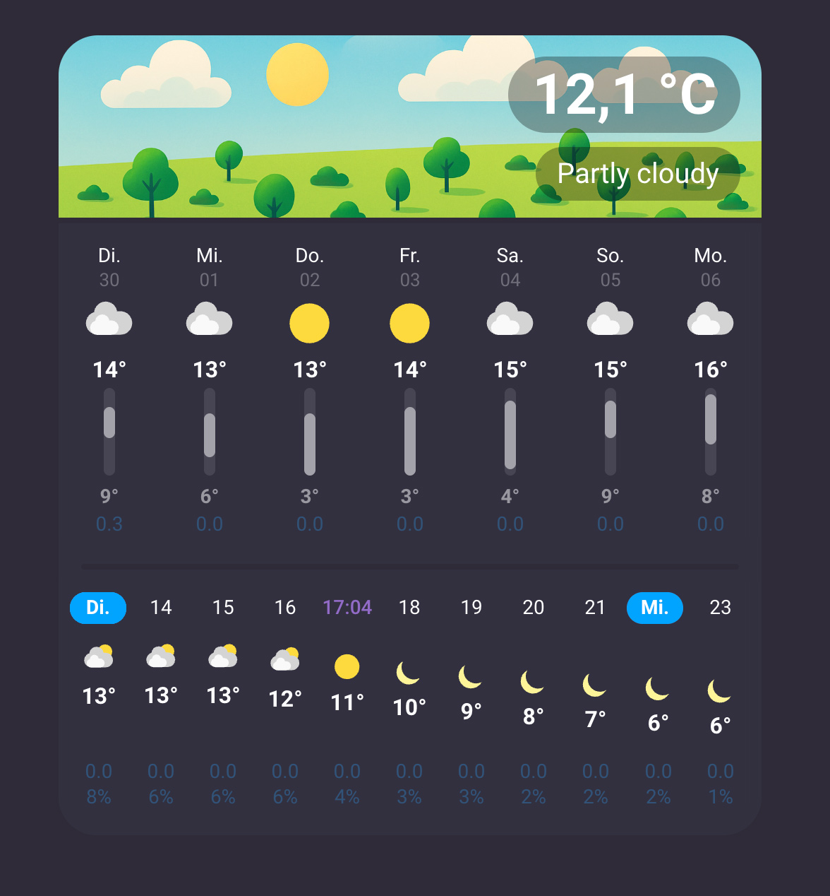
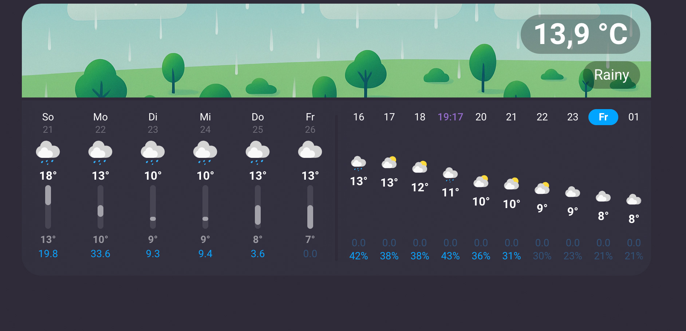
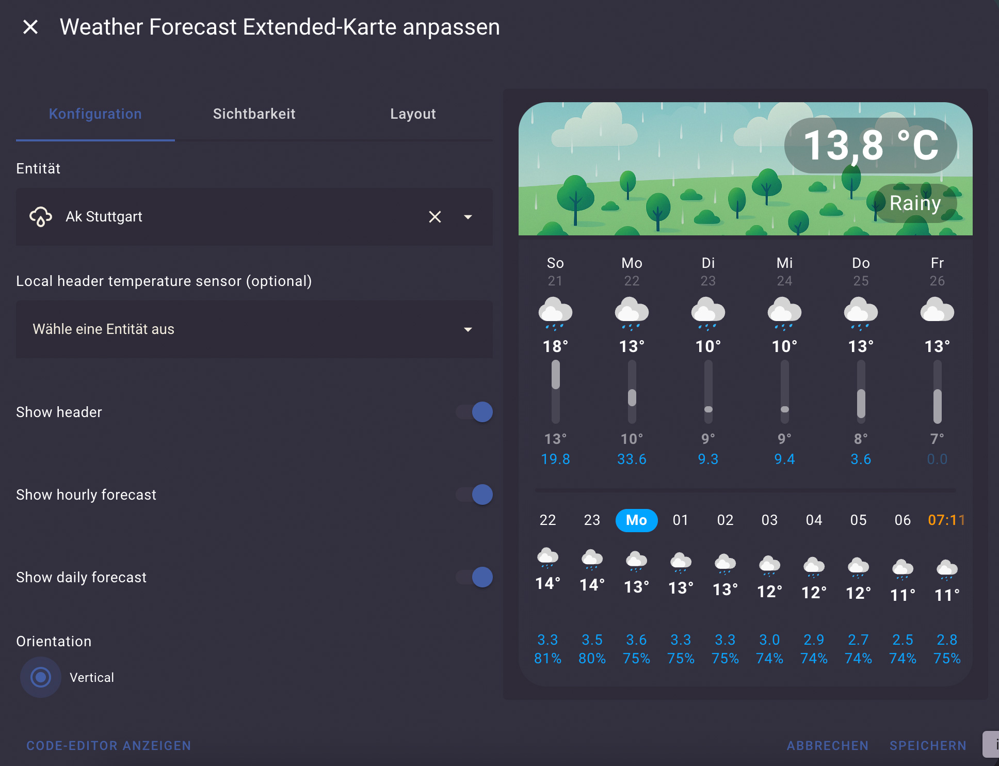

# Weather Forecast Extended Card







## Overview
Weather Forecast Extended is a Lovelace custom card for Home Assistant that combines a large weather header with interactive daily and hourly forecasts. The card displays the forecast from the selected `weather` entity, adapts to the dashboard grid, and adds visual context such as sunrise and sunset markers, precipitation values, and day or night specific artwork.

## Features
- Header area that shows the current condition and temperature with day and night background artwork.
- Daily and hourly forecast sections that can be shown together or independently.
- Click on a day in the daily list scrolls the hourly forecast to the same date.
- Optional sunrise and sunset times embedded in the hourly forecast, using either the Home Assistant location or custom coordinates for sun calculations.
- Configurable header chips that can display entity attributes or value-templates in the header.
- Optional tap actions on the header temperature and condition pills.
- Optional tap actions on each header chip.
- Support for 12 or 24 hour time formats and localized date labels using the Home Assistant user settings.
- UI card editor

## Installation
### HACS (recommended)
1. In Home Assistant, open *HACS > Frontend* and click the three-dot menu in the top right.
2. Choose *Custom repositories*, add `https://github.com/Thyraz/weather-forecast-extended`, and set the category to *Dashboard*.
3. Search for "Weather Card Extended" in HACS, install the latest release, and let HACS add the resource to your dashboard automatically.
4. Reload the browser or clear the Lovelace cache if the new card type is not immediately available.

## Usage
Once the resource is installed, add a new card in the Lovelace dashboard editor and search for **Weather Forecast Extended**. The visual editor exposes every option listed below. You can also configure the card in YAML:

```yaml
type: custom:weather-forecast-extended-card
entity: weather.home
```

### Extended example
```yaml
type: custom:weather-forecast-extended-card
entity: weather.home
header_temperature_entity: sensor.weather_station_temperature
show_header: true
hourly_forecast: true
daily_forecast: true
daily_min_gap: 30
hourly_min_gap: 16
orientation: vertical
show_sun_times: true
sun_use_home_coordinates: false
sun_latitude: 48.137
sun_longitude: 11.575
use_night_header_backgrounds: true
```

## Configuration options
| Option | Type | Default | Description |
| --- | --- | --- | --- |
| `type` | string | `custom:weather-forecast-extended-card` | Lovelace card type identifier. |
| `entity` | string | required | Weather entity that supplies current conditions and forecast data. |
| `header_temperature_entity` | string | current weather temperature | Optional sensor to use for the header temperature. Must report a numeric temperature. |
| `show_header` | boolean | `true` | Toggles hero header containing artwork, current temperature, and condition text. |
| `hourly_forecast` | boolean | `true` | Shows the hourly forecast. Requires the selected weather entity to provide hourly data. |
| `daily_forecast` | boolean | `true` | Shows the daily forecast. |
| `daily_min_gap` | number | `30` | Minimum gap in pixels between daily forecast items. Must be `≥ 10`. |
| `hourly_min_gap` | number | `16` | Minimum gap in pixels between hourly forecast items. Must be `≥ 10`. |
| `orientation` | `vertical` \| `horizontal` | `vertical` | Stacks sections vertically (default) or places daily and hourly lists side by side. |
| `show_sun_times` | boolean | `false` | Adds sunrise and sunset markers to the hourly forecast. Requires valid coordinates. |
| `sun_use_home_coordinates` | boolean | `true` | Uses Home Assistant's home location for sun calculations when `show_sun_times` is enabled. Set to `false` to provide manual coordinates. |
| `sun_latitude` | number \| string | Home Assistant latitude | Latitude used when `sun_use_home_coordinates` is `false`. Accepts decimal degrees as string or number. |
| `sun_longitude` | number \| string | Home Assistant longitude | Longitude used when `sun_use_home_coordinates` is `false`. Accepts decimal degrees as string or number. |
| `use_night_header_backgrounds` | boolean | `true` | Switches the header artwork to night variants when the sun is down. Set to `false` to always use the day theme. |
| `header_tap_action_temperature` | action | none | Lovelace action that fires when the header temperature pill is tapped. Only tap actions are supported. |
| `header_tap_action_condition` | action | none | Lovelace action that fires when the header condition pill is tapped. Only tap actions are supported. |
| `header_chips` | array | `[]` | Up to three chip definitions shown in the header. Each chip can display an entity attribute or template output and may include its own `tap_action`. |

> Tip: The card editor prevents you from hiding every section at once, but in YAML you should also keep at least one of `show_header`, `daily_forecast`, or `hourly_forecast` enabled so the card has content to render.

### Header chips
Header chips allow yout to display additional information, such as precipitation probability, feels-like temperature, or custom strings using value-templates. The editor lets you pick between **Attribute** and **Template** mode for each slot.

```yaml
type: custom:weather-forecast-extended-card
entity: weather.home
header_chips:
  - type: attribute
    attribute: humidity
    tap_action:
      action: more-info
  - type: template
    template: "{{ 'Temp: ' ~ state_attr('weather.home', 'temperature') | round(0) }}°"
    tap_action:
      action: navigate
      navigation_path: /lovelace/weather
  - type: attribute
    attribute: pressure
```

- `attribute` chips expose an attribute from the configured weather entity. The editor provides a dropdown populated with the entity's attributes.
- `template` chips are rendered by Home Assistant's template engine and can reference any entity.
- Each chip accepts an optional `tap_action` (tap only).

### Header tap actions
Attach tap-only Lovelace actions to the temperature and condition pills in the header. Configure them in the card editor under **Header options** or in YAML:

```yaml
type: custom:weather-forecast-extended-card
entity: weather.home
header_tap_action_temperature:
  action: navigate
  navigation_path: /lovelace/weather
header_tap_action_condition:
  action: more-info
```

## Interactions and layout
- Drag or flick the daily and hourly lists.
- Temperature bars in the daily list scale to the minimum and maximum across the visible forecast window, helping you spot warm or cold days quickly.
- The hourly list highlights precipitation totals and probabilities above a fixed thresholds.
